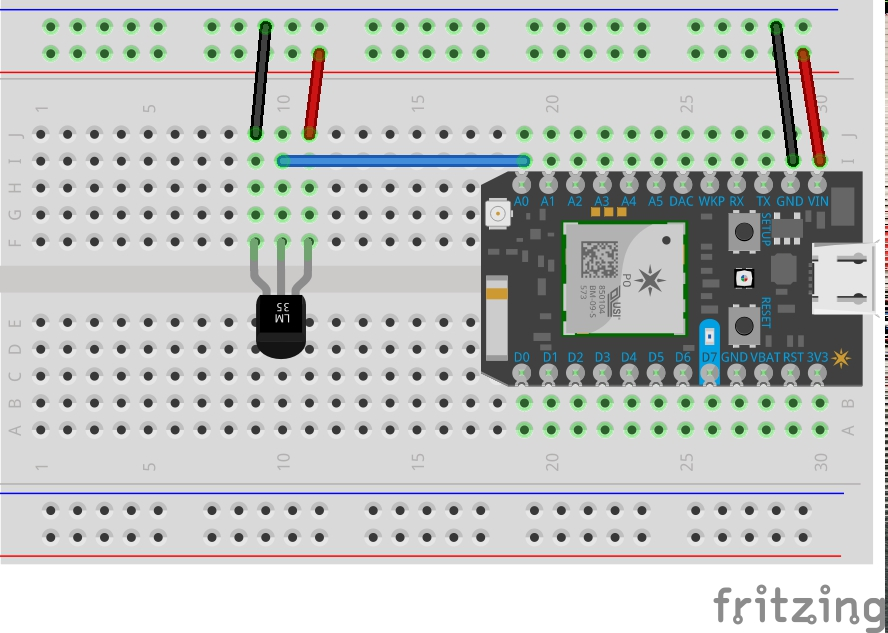

# Tempiot

> Temperature sensor logging for IoT backend platforms

## Hardware wiring

1. [Particle Photon](https://store.particle.io/collections/photon) and [LM35](http://www.ti.com/product/LM35) Temperature sensor
- Wire it up with the breadboard

  
- Flash the [firmware](firmware.ino)
- get the temperature sensor value from the key `result`

  ```
  curl "https://api.particle.io/v1/devices/{device_id}/temperature?access_token={access_token}"
  ```

## License

MIT
